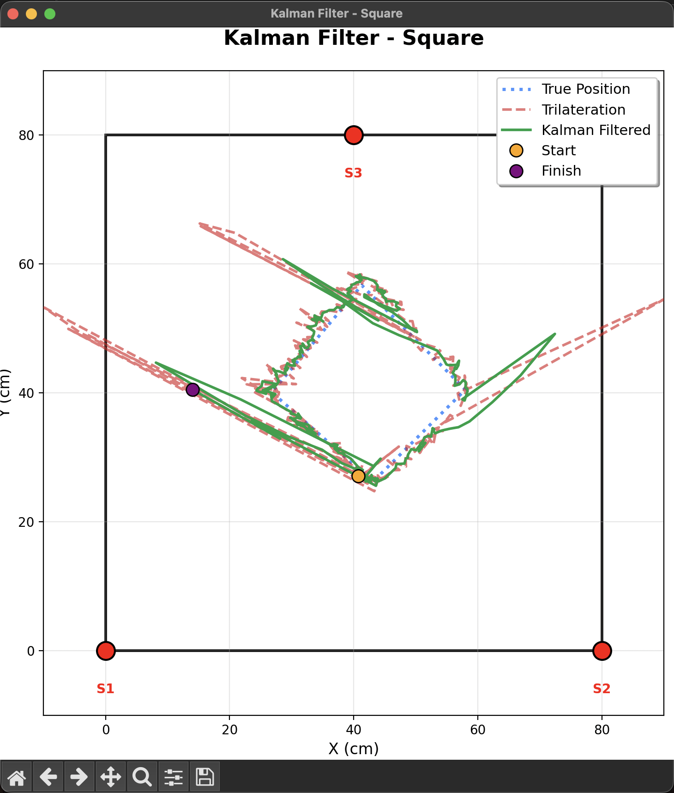
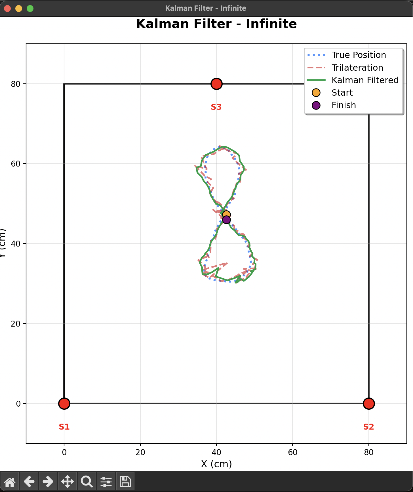

# Ultrasonic Indoor Positioning with Kalman Filter
An indoor tracking system using ultrasonic sensors to estimate the position of a moving object.

### System Architecture
1. **Data Acquisition:** Arduino collects TOF (Time-of-Flight) data from ultrasonic transceivers.
- **Positioning:** A Python script implements a trilateration algorithm to get (x, y) coordinates.
- **Filtering:** A Linear Kalman Filter is applied to remove sensor noise and smooth the trajectory.

### Experimental Results
Below are the results of the tracking for different trajectories. The red line represents raw noisy data, while the green line shows the filtered path.

